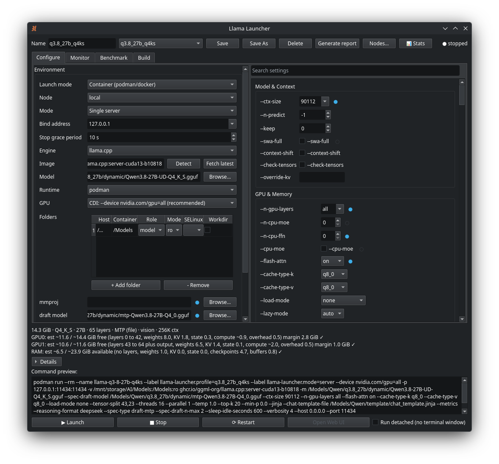
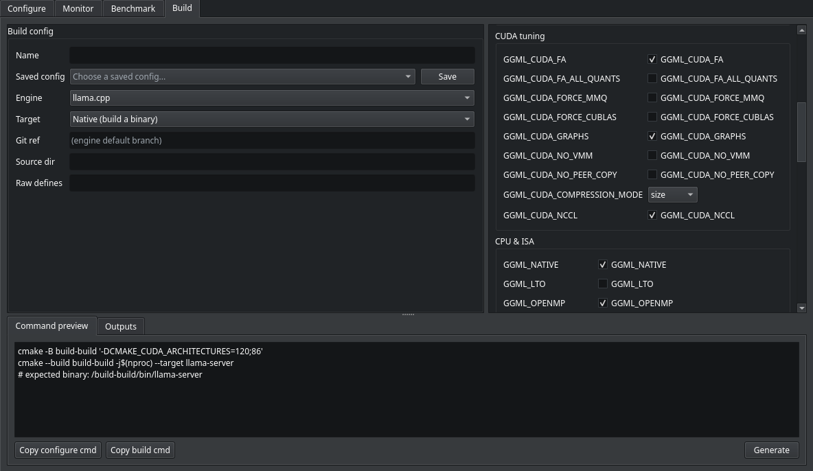
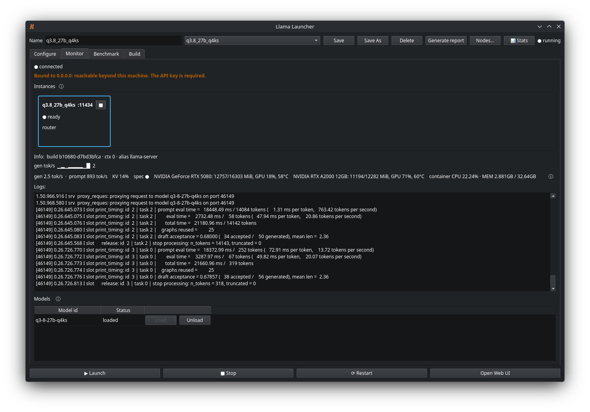
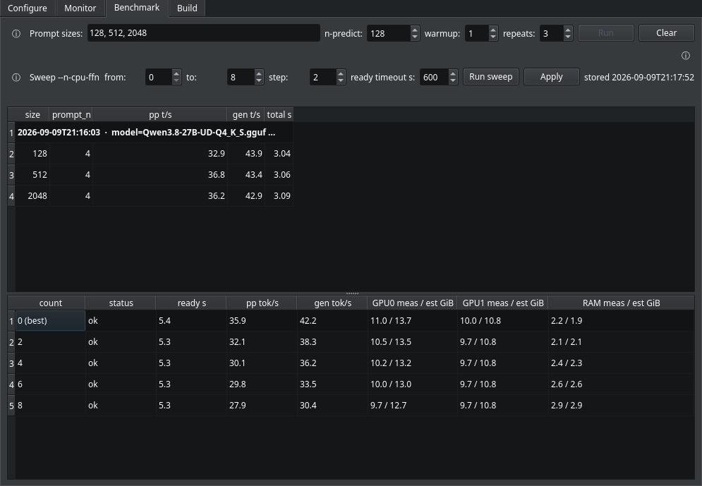
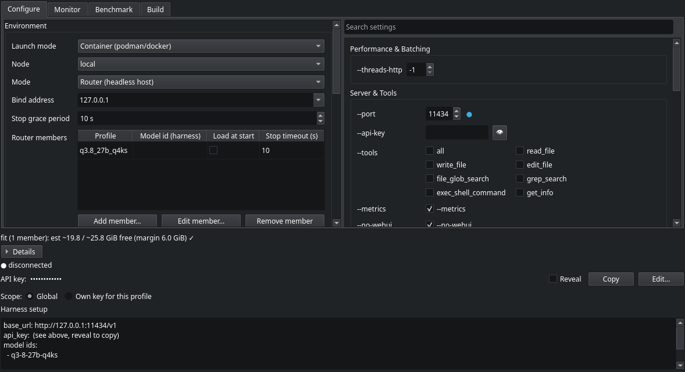

# Llama Launcher

A PySide6/Qt6 desktop app that builds a `podman`/`docker` `llama-server` command from a GUI
and launches it in a terminal (an auto-detected emulator, foreground so `Ctrl-C` works), then
observes the named container from outside. Tabbed **Configure / Monitor** UI with profiles, a
curated `llama-server` settings catalog (plus a raw-args escape hatch), typed mounts,
mmproj/LoRA/draft-model pickers, model-aware capability detection, VRAM preflight, a live
throughput/MTP monitor, and a repeatable speed benchmark for A/B-ing config changes.

Beyond single-container launches it can also run a **prebuilt binary natively** (no container),
drive **remote machines** over podman-over-SSH, **pool VRAM+RAM across nodes** via llama.cpp
RPC, show a live **CPU/GPU/memory stats dock**, and write **custom build commands** for both
engines from a CMake-flag catalog (the Build tab), tracking the image tags and binaries those
builds produce.

## Requirements

- **Python ≥ 3.12.** Developed and CI-tested on 3.12 and 3.13; the code itself only
  needs 3.10+, but 3.10/3.11 are untested. On Ubuntu you may also need
  `sudo apt install python3-venv` before creating a virtualenv.
- `podman` (or `docker`) on `PATH`. See [podman vs docker](#podman-vs-docker) below.
  Local single-server launches work with either; remote multi-node currently requires podman.
- **A GPU is optional.** An NVIDIA GPU (driver +
  [NVIDIA Container Toolkit](https://github.com/NVIDIA/nvidia-container-toolkit)) unlocks GPU
  offload; without one, set GPU mode to **None** and use a CPU image to run CPU-only. AMD
  (ROCm) is not yet wired up; see [AMD GPUs](#amd-gpus-help-wanted).
- A terminal emulator for foreground launches (auto-detected: konsole, gnome-terminal,
  ptyxis, kgx, foot, …; override with the `terminal` config key)
- For **remote nodes / RPC pools**: `openssh-client` (`ssh`) on `PATH`.

## Quickstart: your first running model



*The Configure tab: choose engine, image, model, and GPU mode; the exact command and a live VRAM-fit estimate update as you edit.*

After installing (below), the GUI opens on the **Configure** tab:

1. **Point at your models.** In the **Folders** row, add a mount whose *host* path is the
   directory holding your `.gguf` files (e.g. `/home/you/models`) and whose *container* path
   is something like `/models`. This makes the host directory visible inside the container.
2. **Pick a model.** Use the **Model** row's **Browse…** to select a `.gguf` under that mount.
   The launcher reads its metadata and shows a live VRAM-fit estimate.
3. **Set the image.** Click **Detect** to list llama.cpp images you've already pulled, or type
   one, e.g. `ghcr.io/ggml-org/llama.cpp:server-cuda` (GPU) or a CPU-tagged build for
   CPU-only (see [Running without a GPU](#running-without-a-gpu)).
4. **Choose GPU mode** (Runtime section): **CDI** for NVIDIA (see [GPU passthrough](#gpu-passthrough)),
   or **None** for CPU-only.
5. **Save** the profile (give it a name), then **Launch**. A terminal window opens and streams
   `llama-server`; when it's ready, the **Monitor** tab shows live throughput and the **Open Web
   UI** button opens the server.

The command being built is always visible in the preview strip at the bottom. Nothing is
hidden. `--dry-run` (below) prints it without launching.

## Install & run

```bash
python3 -m venv .venv
.venv/bin/pip install -e ".[dev]"

.venv/bin/llama-launcher                                   # GUI
# or: .venv/bin/python -m llama_launcher.app

.venv/bin/python -m llama_launcher.app --dry-run --profile "NAME"   # print the command, don't launch
.venv/bin/pytest -q                                        # test suite (offscreen Qt)
```

Or with [uv](https://docs.astral.sh/uv/):

```bash
uv venv                                # create .venv (Python ≥ 3.12)
uv pip install -e ".[dev]"

uv run llama-launcher                  # GUI  (NOT `llama_launcher.app`; that's a module, not a command)
uv run python -m llama_launcher.app    # module form of the same GUI
uv run python -m llama_launcher.app --dry-run --profile "NAME"
uv run pytest -q                       # test suite
```

### Install straight from GitHub (no clone)

To just run the app, install it from GitHub with uv (no clone, no PyPI needed):

```bash
uv tool install git+https://github.com/impermanent-cc/llama_launcher

llama-launcher                         # GUI, now on your PATH
```

`uv tool upgrade llama-launcher` later pulls the newest commit. To run it once without
installing anything, use
`uvx --from git+https://github.com/impermanent-cc/llama_launcher llama-launcher`.

## GPU passthrough

The launcher offers three GPU modes (Configure tab → **Runtime**):

- **CDI (`--device nvidia.com/gpu=all`)** (recommended for NVIDIA): uses the NVIDIA Container
  Device Interface spec.
- **Legacy (`--gpus all`)**: the older runtime hook; doesn't read the CDI spec.
- **None**: no GPU passthrough; the model runs CPU-only. See
  [Running without a GPU](#running-without-a-gpu).

### First-time CDI setup

A freshly installed NVIDIA Container Toolkit has **no** CDI spec until you generate one once:

```bash
sudo nvidia-ctk cdi generate --output=/etc/cdi/nvidia.yaml
```

Without this, a CDI-mode launch fails with `crun: cannot stat /usr/lib/libnvidia-*.so` or
`unresolvable CDI devices`. Re-run the same command after a driver update (the spec references
exact driver library paths and goes stale). Docker users configure GPU access differently; see
below.

### Running without a GPU

No NVIDIA card? Set **GPU mode → None** and use a CPU-tagged image (for mainline llama.cpp,
a `server`/`full`-family CPU build rather than the `-cuda` tag). Everything else works the
same; the VRAM-fit estimate and GPU stats simply stay empty. CPU inference is slower, so small
or heavily quantized models are the practical choice.

### podman vs docker

Local single-server launches work with either runtime (pick it in the Runtime section or the
Nodes dialog). Two caveats:

- **GPU setup differs.** The CDI instructions above are the podman path. For docker, use
  `sudo nvidia-ctk runtime configure --runtime=docker && sudo systemctl restart docker`, then
  Legacy (`--gpus all`) mode.
- **Remote nodes currently require podman** (they use podman's `--connection`/SSH transport).

### Run detached (no terminal window)

Each server profile has a **Run detached** checkbox next to Launch. Leave it
off (the default) to launch into a terminal window as before. Check it to
launch with no terminal: the container runs detached (`-d`), its output
streams to the **Monitor** tab, and **Stop** shuts it down. If the launch
fails (bad image, GPU/CDI, bad flag), a dialog shows the failure reason; the
container also persists (it isn't auto-removed), so its logs remain readable
after a crash. The setting is saved per profile. Router profiles are always
detached, so the checkbox is hidden for them.

### ik_llama.cpp engine

Select **Engine → ik_llama.cpp** in Configure to run ikawrakow's fork instead of
mainline llama.cpp. It uses the same `llama-server` CLI, so profiles work the same
way; the launcher adds ik-only flags (run-time-repack, MLA, fused-MoE toggle,
attention-max-batch, smart-expert-reduction, draft context size, SWA compression,
indexer cache type) and extra KV-cache quant types and speculative strategies,
shown only when this engine is selected and never passed to a mainline launch.
Speculative type names are translated automatically to ik's spellings.

Images live at `ghcr.io/ikawrakow/ik-llama-cpp`; use the `*-server` tag for single
server mode and the `*-swap` tag for router mode (e.g. `cu12-server`, `cpu-server`).
**Detect** lists your locally-pulled ik images when this engine is selected.

Either engine can also be run from a self-built binary; see **Native launch** below.

## Build helper



*The Build tab: pick engine, target, and CMake options; copy the generated configure/build commands and run them yourself.*

The **Build** tab generates copyable build command strings for compiling llama.cpp
and ik_llama.cpp from source. Unlike Configure and Launch, it never runs a build; it
renders command strings (native: a cmake configure and build pair; container: a
Containerfile plus a podman build command) for you to run manually, experimenting with
CMake flags like `-DGGML_CUDA=ON` or `-DGGML_CUDA_FA=ON`.

Saved build configs remember your choices. Each generated build is recorded with its
output (image tag or binary path) and tracked as **built** (exists locally), **missing**
(generated but not yet built), or **untracked** (custom-tagged images built outside the
app). The **Outputs** table shows all of them by identifier, status, size, creation
date, and saved-config name; hover a row for engine, git ref, and build parameters.
You can delete stale builds or use the **Use in profile** action to write an image
tag into a container profile's **Image** field, or point a native profile at a
freshly-built binary.

Image management is local to this machine only; remote nodes manage their own images.
Native binaries are machine-specific and do not work remotely yet.

## Native (non-container) launch

To run a prebuilt `llama-server` binary directly instead of pulling an image, set
Configure → **Launch mode** to **Native (run a built binary)**. A **llama-server binary**
row appears: type the path or use **Browse…** to point at your executable (mainline or
ik_llama.cpp). Selecting native hides all container-only controls (Image, Runtime, GPU mode,
Folders/mounts, Extra podman args, SELinux, and Run detached), since none apply.

The launcher runs the binary as a managed background process (its own session), streams its
output to a per-profile log file, and tracks it by PID, so **Stop**, **Remove**, logs, and
the live monitor work just as they do for a container. GPU visibility, threads, and paths are
whatever the binary itself sees on the host; there are no mounts to configure.

Constraints: native mode is **GUI-only** (headless `--launch` refuses it) and **does not
support router mode**. Use a container runtime for routers. Validation requires the path to
exist and be executable before anything starts.

## Remote nodes (multi-machine)

Drive `llama-server` on other machines from this one GUI, over podman-over-SSH (for capacity
and experimentation, not for speeding up a single model). Click **Nodes…** in the top bar to
open the **Nodes** manager: give each machine a **Name**, an **SSH target** (`user@host[:port]`
or a bare `host`), and its container **Binary** (podman/docker), then **Add**. **Test** reports
whether the node is reachable and whether its GPUs are visible; **Remove** deletes it. Nodes
persist across sessions (the name `local` is reserved for this machine).

To run a profile on a registered machine, pick it in the Configure → **Node** dropdown.
Selecting a remote node flips the bind address to `0.0.0.0` automatically so the GUI host can
reach the server's `/health` and `/metrics`, which means the exposure guard then requires an
**API key** (see below). The **Monitor** tab fans out across every enabled node: each running
instance is shown as its own card, tagged `· <node>` for remotes, and its logs/stats are read
over that node's connection. One unreachable node degrades to zero cards for itself without
blanking the rest.

## RPC pool: pooling VRAM+RAM across machines (experimental)

> **Under construction.** RPC pooling is wired up in the GUI but has not yet been
> verified by the author on real multi-GPU hardware, and the build is still being
> planned out. Treat it as experimental and expect rough edges; the build recipe
> and current status live in [`RPC.md`](RPC.md).

To run a model larger than any single machine's memory, set Configure → **Launch mode** to
**RPC pool (multi-node)**. This pools VRAM+RAM across several machines using llama.cpp's
`rpc-server`: an **RPC workers** table appears (columns **Node · Device · Contribution MB ·
Port**, one row per worker; **+ Add worker** / **- Remove**), and the head `llama-server` runs
locally. **Check fit** probes each worker's node for free VRAM/RAM and reports whether the pool
can hold the selected model, with any per-node warnings. At launch the workers start first
(SSH-tunnelled when remote), and once ready the head connects to them; the Monitor shows each
worker as its own `rpc-worker · <node>` card.

RPC pool mode is **GUI-only** (headless refuses it) and needs a `GGML_RPC=ON` image the
prebuilt tags don't include. See [`RPC.md`](RPC.md) for the build recipe and full details.

## Instances panel (Monitor tab)



*The Monitor tab: per-instance cards (generation tok/s, KV%), live GPU/CPU stats, and the streaming server log.*

The top of the Monitor tab lists every server this launcher has started, with
its port, health, and a live summary stat (generation tok/s, or "ready" for an
embedding/rerank server). This means you can run, say, a generation model **and**
an embedding model for RAG at once and keep an eye on both. Switching the
Configure form to another profile no longer hides what's running.

Click a row to point the full Monitor (and logs) below at that instance; the
■ button on a row stops it. Selecting an instance to watch does not change the
profile you're editing.

## Benchmark



*The Benchmark tab: pick prompt sizes, warmup, and repeats; results report prompt-eval and generation tok/s per size.*

The **Benchmark** tab runs a controlled, repeatable speed
measurement so a config change (flags or model) can be compared apples-to-apples.
It POSTs standardized filler prompts to the running server and reads llama.cpp's
`timings` to report **prompt-eval** and **generation** tok/s at each prompt size.

Configure the run inline: prompt **sizes** (default `128, 512, 2048` tokens),
**n_predict** (128), **warmup** runs (1, discarded), and **repeats** (3, averaged).
Requests always use `temperature 0` / `stream false`. **Run** is enabled only when
the server is running and ready (in router mode, also only while a model is
loaded); results fill a table of size · prompt_n · pp t/s · gen t/s · total s.

Each run is saved to a **per-profile history** (last 5, newest first), labelled
with a compact snapshot of the config it ran under (e.g. `-ngl99 fa=on`). The
latest run shows a **delta** versus the previous one (e.g. `Δ pp +8% · gen +3%`),
so changing a flag and re-running tells you immediately whether it helped. Works
for both single-model **server** and **router** profiles (router scopes the
request to the loaded model).

## Stats dock (live CPU / GPU / memory)

Toggle the **📊 Stats** button in the top bar (or `Ctrl+Shift+S`) to show a dockable live
stats panel on the side. It samples once a second **only while visible** and shows three
groups:

- **GPU**: per-card name, utilisation % (with a sparkline), VRAM used/total, temperature, and
  power draw (via `nvidia-smi`; shows *unavailable* when there's no GPU).
- **System**: overall CPU % and per-core sparklines, RAM used/total, and 1/5/15-minute load.
- **Container**: the monitored server's name, CPU %, and memory use.

The dock's open/closed state and width are remembered between sessions.

## Stop grace period

Each profile has a **Stop grace period** spin box (Configure tab, default **10 s**, range
1-300). It's the time **Stop** waits after `SIGTERM` before force-killing (`SIGKILL`), i.e.
`podman stop -t <n>`. Raise it if a large model needs longer to unload cleanly. The same value
is reused for native-process and RPC-pool teardown; router *members* have their own per-row
stop timeout in the Router members table.

## Router API key



*Router mode: member profiles served through the router's port, with the managed API key and ready-to-copy harness settings.*

A router authenticates clients with a bearer API key (`sk-…`), shown on the
Router panel with Reveal/Copy. Point your harness at `http://HOST:PORT/v1`
with this key.

Two scopes control where the key comes from:

- **Global** (default): one shared key used by every router profile. Set it
  once and every global-scope profile serves it, so a harness needs the key
  only once, even when you switch profiles.
- **Own key for this profile**: pin a distinct key on a specific profile
  when you want it isolated from the shared one.

Use **Edit…** to paste your own key value or click **Generate** for a fresh
one, then **Save**. Saving a global key updates every global-scope profile at
once. Changing a key takes effect the next time the router launches.

## Headless control

Drive a profile without the GUI (for test harnesses). Runs on the host with
podman + the GPU; the harness connects in over the network.

    llama-launcher --launch --profile PROFILE [--wait[=SECONDS]]
    llama-launcher --stop   --profile PROFILE
    llama-launcher --health --profile PROFILE

`--profile` falls back to the last-used profile. `--launch --wait` blocks until
the server answers `/health` (default 60s; models still load on demand).

Works for **router** and single-model **server** profiles. A validation error
(including a bind past loopback with no API key) is refused (exit 2) before
anything starts. A headless server launch runs **detached and persistent**
(`-d`, no `--rm`), unlike the GUI's foreground `--rm` server, so `--stop` and
`--health` can address it by container name.

**Native** (self-built binary) and **RPC pool** profiles are GUI-only in this
version and are refused headlessly (exit 1) with an explanatory message. See
[`RPC.md`](RPC.md) for building the `GGML_RPC=ON` image an RPC pool needs.

Exit codes:

| code | `--launch` | `--stop` | `--health` |
|------|-----------|----------|-----------|
| 0 | started (ready, with `--wait`) | stopped / already stopped | ready |
| 1 | container run failed | stop failed | n/a |
| 2 | usage/config error | usage/config error | usage/config error |
| 3 | n/a | n/a | loading |
| 4 | n/a | n/a | down / stopped |
| 5 | `--wait` timed out (started, not ready) | n/a | n/a |

### JSON output

Add `--json` to any of the three commands to get one JSON object on stdout
(and nothing on stderr) instead of a human-readable line, for scripting and
test harnesses:

    llama-launcher --launch --profile ROUTER --json

Every outcome (success, warnings, action failure, and the pre-flight gate
refusal) is a single object. Warnings live inside the object, not on stderr.
The process exit code is unchanged (there is no `exit` field; `ok` mirrors it):

    {"action": "launch", "ok": true, "status": "started", "name": "llama-router",
     "host": "0.0.0.0", "port": 8080, "warnings": [], "error": null}

| field | meaning |
|-------|---------|
| `action` | `"launch"`, `"stop"`, or `"health"` |
| `ok` | `true` iff the process exit code is 0 |
| `status` | launch: `"started"` / `"ready"`; stop: `"stopped"`; health: `"ready"` / `"loading"` / raw state; `null` on failure |
| `name` / `host` / `port` | container name and address when known, else `null` |
| `warnings` | preset/router warnings (empty list when none) |
| `error` | failure or gate-refusal message, else `null` |

## Troubleshooting

### `crun: cannot stat /usr/lib/libnvidia-*.so.<version>: No such file or directory`

**Cause:** you're in CDI mode and the CDI spec is stale. The spec
(`/etc/cdi/nvidia.yaml`, or `~/.config/cdi/nvidia.yaml` for rootless) is a *static snapshot*:
it lists driver library paths pinned to an exact version **and** enumerates the specific GPUs
present when it was generated. It does not update itself. Anything that changes the driver files
or the set of cards will break it, most commonly:

- an **NVIDIA driver update** (the version-pinned `.so` paths no longer exist), or
- a **reboot that applied a pending driver update**, or
- **adding/removing a GPU** (the old spec still only knows about the previous cards).

**Fix (regenerate the spec on the host):**

```bash
sudo nvidia-ctk cdi generate --output=/etc/cdi/nvidia.yaml
nvidia-ctk cdi list        # confirm: nvidia.com/gpu=all, =0, =1, ...
```

Rootless podman without write access to `/etc/cdi`:

```bash
mkdir -p ~/.config/cdi
nvidia-ctk cdi generate --output ~/.config/cdi/nvidia.yaml
```

Then relaunch. After regenerating, `nvidia-ctk cdi list` should show **one entry per card**
(`=0`, `=1`, …); if a card is missing, `nvidia.com/gpu=all` won't use it. To pin a profile to a
single card, put e.g. `nvidia.com/gpu=1` in the launcher's extra run args instead of `all`.

> **Rule of thumb:** run `sudo nvidia-ctk cdi generate` any time the GPU hardware or the NVIDIA
> driver changes. As a temporary workaround you can switch the GPU mode to **Legacy (`--gpus all`)**,
> which doesn't use the CDI spec, but regenerating the spec is the real fix.

### `could not load the Qt platform plugin "xcb"`

On a minimal or server-style install the system Qt libraries the GUI needs may be missing.
Installing the platform plugin dependencies fixes it: on Debian/Ubuntu that's typically
`sudo apt install libxcb-cursor0 libxkbcommon0`, and on a Wayland session also
`qt6-wayland` (or your distro's equivalent). A full desktop install usually already has these.

## AMD GPUs (help wanted)

AMD/ROCm GPU offload is **not implemented**; the VRAM/stats probing is NVIDIA-only
(`nvidia-smi`). CPU-only mode works on any machine. If you have AMD hardware and want to
add `rocm-smi` support (GPU stats + VRAM-fit estimation), contributions are very welcome;
the GPU-probing code lives in `src/llama_launcher/services/gpu.py`.

## Contributing

Bug reports and small fixes are welcome; for anything larger, please open an issue first
so the shape can be agreed. See [CONTRIBUTING.md](CONTRIBUTING.md) for setup, the two
areas where help is most wanted, and the two constraints (catalog-driven settings,
hermetic tests) worth knowing before writing code.

## Security

Please do not report vulnerabilities in a public issue. Use the repository's **Security**
tab and choose **Report a vulnerability**. [SECURITY.md](SECURITY.md) covers what is in
scope, what is not, and the hardening already in place.

## License

MIT. See [LICENSE](LICENSE). Depends on [PySide6](https://doc.qt.io/qtforpython/) (LGPL-3.0),
installed separately via pip and subject to its own terms, including your right to modify or
replace it.

## AI assistance

Llama Launcher is developed with AI assistance (Anthropic Claude, via Claude Code)
under the project owner's direction, and every change is human-reviewed before
release. See [AI-ASSISTANCE.md](AI-ASSISTANCE.md) for the full disclosure.
